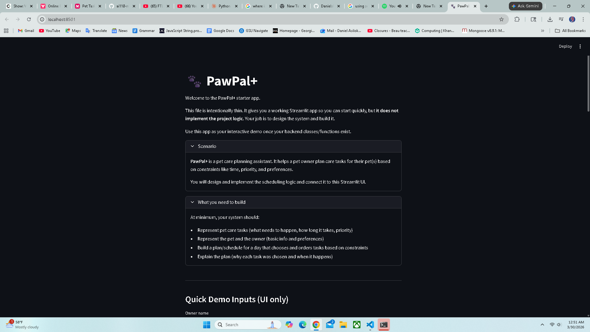

# PawPal+ (Module 2 Project)

You are building **PawPal+**, a Streamlit app that helps a pet owner plan care tasks for their pet.

## Scenario

A busy pet owner needs help staying consistent with pet care. They want an assistant that can:

- Track pet care tasks (walks, feeding, meds, enrichment, grooming, etc.)
- Consider constraints (time available, priority, owner preferences)
- Produce a daily plan and explain why it chose that plan

Your job is to design the system first (UML), then implement the logic in Python, then connect it to the Streamlit UI.

## What you will build

Your final app should:

- Let a user enter basic owner + pet info
- Let a user add/edit tasks (duration + priority at minimum)
- Generate a daily schedule/plan based on constraints and priorities
- Display the plan clearly (and ideally explain the reasoning)
- Include tests for the most important scheduling behaviors

## Getting started

### Setup

```bash
python -m venv .venv
source .venv/bin/activate  # Windows: .venv\Scripts\activate
pip install -r requirements.txt
```

### Suggested workflow

1. Read the scenario carefully and identify requirements and edge cases.
2. Draft a UML diagram (classes, attributes, methods, relationships).
3. Convert UML into Python class stubs (no logic yet).
4. Implement scheduling logic in small increments.
5. Add tests to verify key behaviors.
6. Connect your logic to the Streamlit UI in `app.py`.
7. Refine UML so it matches what you actually built.

#### Smart Scheduling

Greedy Packing Details
Explains the low-priority task optimization strategy:

Collects unplanned low-priority tasks after main scheduling
Sorts by duration ascending (first-fit principle)
Attempts to insert each into remaining time slots
Removes successfully scheduled tasks from unplanned list
Complexity Analysis
Time: O(n log n) for initial sort + O(m) for greedy where m = low-priority count
Space: O(n) for scheduled items and unplanned list

##### Testing PawPal+

I had the AI write tests that cover the programs sorting, recurrence logic, conflict detection, performance, and algorithms I had it write.
My confidence level in the system's reliability is a 4 out of 5.

1. Core Scheduling Algorithm (Scheduler.generate_schedule)
Greedy priority-based scheduling:
Sort tasks by priority (high→medium→low)
Within same priority, sort by duration_minutes descending (long tasks first)
Tie-break by title alphabetically
Time window constraints:
available_minutes = min(owner.time_available, (pref_end - pref_start) * 60)
Reject if available_minutes <= 0 (ValueError)
Sequential assignment:
Fill with sorted tasks until time runs out
Move tasks exceeding remaining time to unplanned_tasks
2. Greedy Packing Secondary pass
After core scheduling, if remaining minutes remain:
Collect unplanned tasks with priority == "low"
Sort by duration ascending (smallest first)
Try to fit each into remaining time, appending scheduled items
Remove successful low tasks from unplanned_tasks
3. Recurring Task Re-creation (Task.mark_complete)
Status update:
status = "completed"
Recurrence behavior:
recurrence == "daily" → returns a new Task with due_date = datetime.now() + 1 day
recurrence == "weekly" → returns a new Task with due_date = datetime.now() + 7 days
recurrence == "none" → returns None
Attribute retention:
title, duration_minutes, priority, assigned_pet, recurrence
4. Sorting Helpers
Scheduler.sort_by_time(result):
Sort schedule items in-place by start_time.strftime("%H:%M")
Return updated ScheduleResult
Scheduler.insert_task_sorted(sorted_task_list, task):
Uses bisect style key insertion (priority/duration/title) for incremental updates
5. Conflict Detection (Scheduler.detect_conflicts)
Scan sorted schedule by start_time
Detect overlap:
current.end_time > next.start_time
Return warning string with conflicting task pairs
Otherwise return None
6. Status Filtering (Scheduler.filter_by_status)
Works for:
task list (List[Task]): returns tasks with matching .status
schedule result (ScheduleResult): returned items whose item.task.status == status
7. Data Model and Integrity
Task:
validation in __post_init__:
priority in {"high","medium","low"}
duration > 0
recurrence in {"none","daily","weekly"}
Pet.tasks:
stored as set for O(1) add/remove/contains
Task hash by identity (id(self)) to avoid value collisions
Owner:
validation on time window and positive availability
add_pet/remove_pet ownership linkage
8. Schedule Output
ScheduleResult.total_planned_minutes property calculates sum of scheduled durations
ScheduleResult.explanation():
human-readable schedule listing + unplanned tasks
window summary + reason text detailing each task decision
9. Streamlit App Integration (app.py)
Generate Daily Schedule:
calls Scheduler.generate_schedule(...)
calls Scheduler.sort_by_time(...)
checks Scheduler.detect_conflicts(...) and warns
renders scheduled items + unplanned pack
uses filter_by_status(...,"pending") for pending entries
🔧 What this means for users
Highest-priority tasks are chosen first
Time-boxed planning is enforced
Scheduler tries to pack low-priority tasks in leftover space
Recurring tasks automatically re-queue for the next period
Overlap conflicts are detected and communicated without crash
Changes are deterministic, test-covered (53 passing tests), and scalable

###### 📸 Demo

